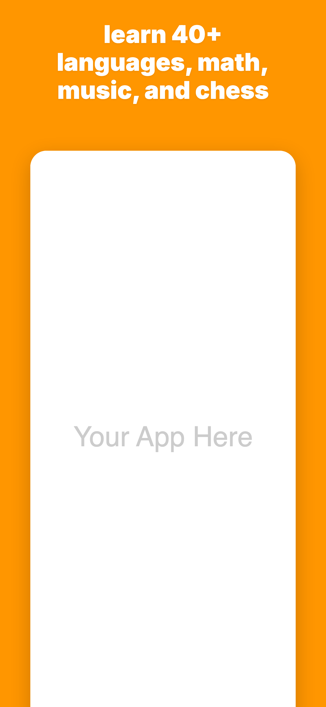
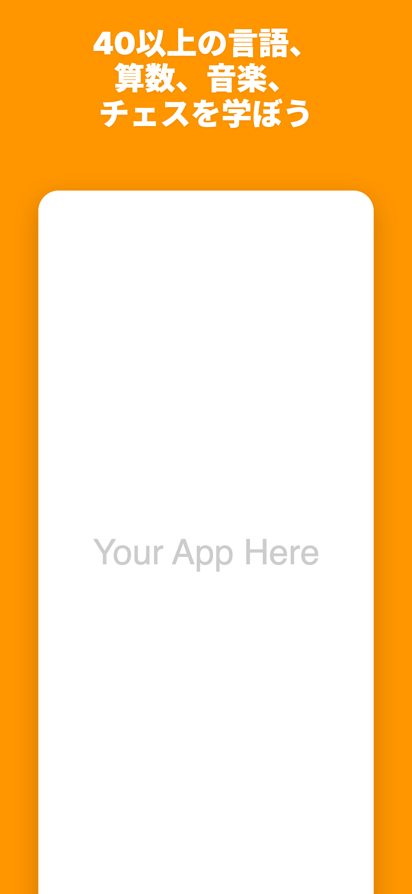
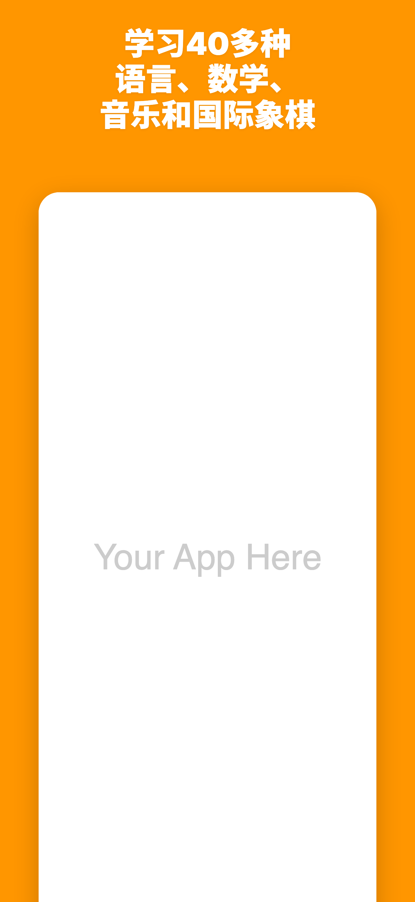
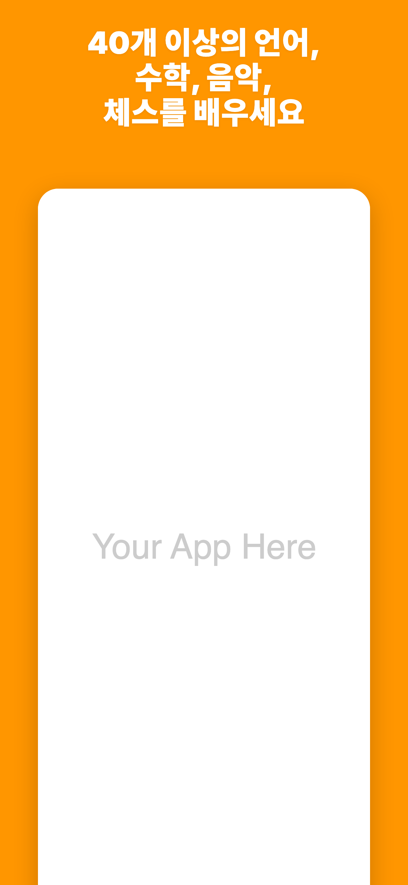
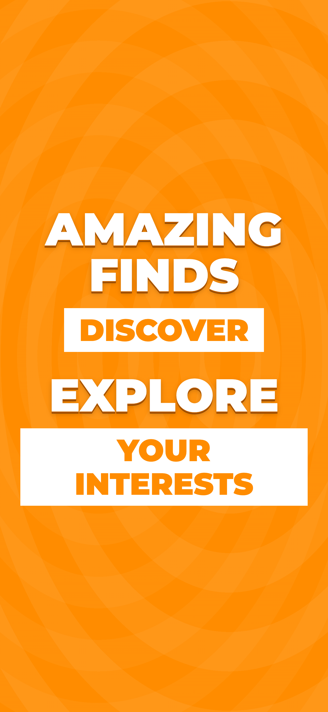
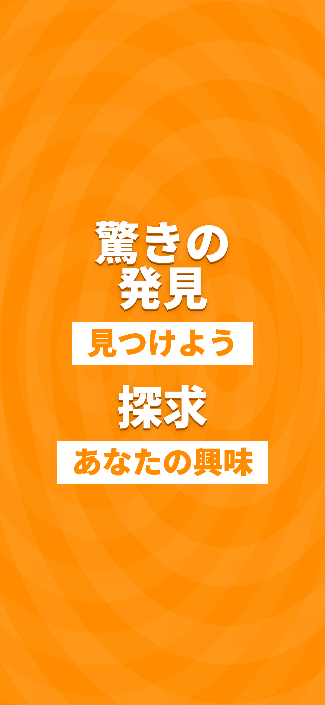
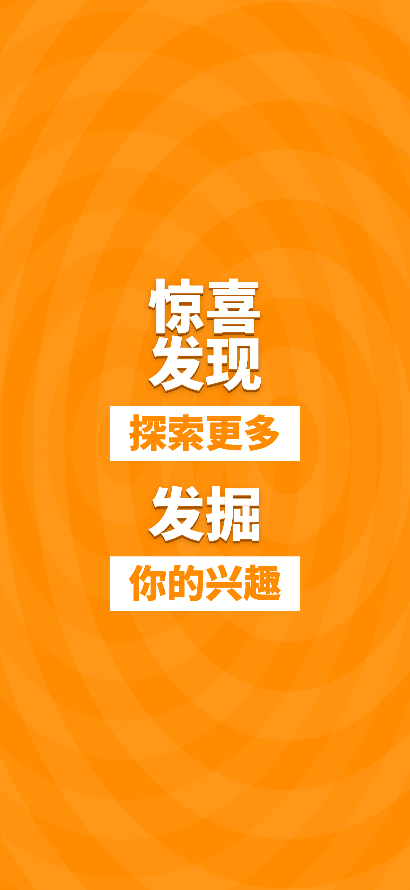
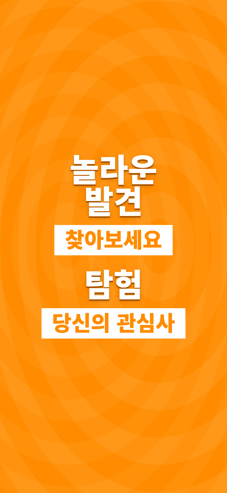

# css-app-store

Generate App Store screenshots with HTML/CSS templates and Playwright.

One command. Four languages. Pixel-perfect PNGs ready for App Store Connect.

<p align="center">
  
  
  
  
</p>

<p align="center">
  
  
  
  
</p>

## The Problem

App Store screenshots are marketing assets — bold typography, vivid gradients, carefully placed device mockups. Most teams build these in Figma or Photoshop, then manually export dozens of variants for each locale and device size.

Support 4 languages? That's 4x the manual work. Need to update a headline? Re-export everything. Change the background color? Open every file. This doesn't scale.

## The Solution

Write your screenshot layouts in HTML and CSS. Define per-locale text in a JSON file. Run a script. Get PNGs.

```
data.json          ← text, colors, image paths per locale
templates/*.html   ← HTML/CSS with {{variable}} placeholders
generate.mjs       ← Playwright renders each locale → PNG
```

1. **Design a template** in `templates/` using HTML and CSS. Use `{{placeholder}}` syntax for anything that varies by locale.
2. **Define your locales** in a JSON data file — one entry per language with text, colors, and asset paths.
3. **Run the generator** — Playwright opens each rendered page in a headless browser and captures a pixel-perfect screenshot at the exact App Store resolution.

## Why CSS?

The web platform is arguably the most heavily invested rendering engine in human history. Trillions of dollars of commerce, media, and communication flow through browsers every day. Decades of engineering by Google, Apple, Mozilla, and Microsoft have produced a typographic and layout engine of extraordinary power — and it's free, open, and runs everywhere.

Everything that Adobe Flash once did — and that designers used to build as rasterized PSDs — is now achievable in plain HTML and CSS. And because it's code, it's **versionable**, **diffable**, **templatable**, and **automatable**.

### What CSS gives you for free

**Typography at every level.** Variable fonts with continuous axes (`font-weight: 100..900`, `font-stretch`, `font-optical-sizing`). Full Unicode text shaping — Latin, CJK, Arabic, Devanagari, Thai, and every other script. Kerning, ligatures, small caps, and stylistic alternates via `font-feature-settings`. Google Fonts gives you instant access to thousands of typefaces.

**Every writing direction.** Horizontal left-to-right. Right-to-left for Arabic and Hebrew (`direction: rtl`). Vertical top-to-bottom for Japanese tategaki (`writing-mode: vertical-rl`). Traditional Mongolian script. Mix them freely in the same layout — CSS handles the bidi algorithm for you.

**Layout that just works.** Flexbox and CSS Grid handle any composition. Center anything in one line. Overlap layers with `position: absolute`. Aspect-ratio containers. Subgrid for nested alignment. No more slicing PSDs into layers.

**Visual effects rivaling native apps.** Gradients (linear, radial, conic). Glassmorphism with `backdrop-filter: blur()`. Blend modes (`mix-blend-mode`, `background-blend-mode`). Clipping and masking (`clip-path`, `mask-image`). Full 3D transforms. Keyframe animations.

**Text effects that used to require Photoshop:**

- **3D extrusion** — stacked `text-shadow` layers for depth
- **Gradient text** — `background-clip: text` with linear/radial/conic gradients
- **Neon glow** — layered `text-shadow` with vivid colors and large blur radii
- **Glitch effects** — `clip-path` with animation and pseudo-elements
- **Outlined text** — `-webkit-text-stroke` for hollow lettering
- **Variable font animation** — animate weight, width, slant, and custom axes in real-time
- **Halftone, retro, frosted** — blend modes + SVG filters + CSS

See [Mandy Michael's CodePen](https://codepen.io/mandymichael) for dozens of stunning pure-CSS text effects, [Jen Simmons' Layout Lab](https://labs.jensimmons.com/) for layout experiments, and [V-Fonts](https://v-fonts.com/) for variable font exploration.

### Two included templates

**`default`** — Classic App Store style. Solid color background, bold headline at the top, app screenshot in a phone frame below. The workhorse layout that most apps use.

**`typography`** — Text-only promotional style. No screenshots — just bold 3D typography with banner accents and a patterned background. Great for feature announcements, seasonal campaigns, or apps where the brand message matters more than the UI.

Both templates support `{{variable}}` substitution for text, colors, and image paths. Create your own by writing any HTML/CSS you want.

## Quick Start

```bash
npm install
npx playwright install chromium

# Generate all locales (default template with app screenshot)
npm run generate

# Generate all locales (typography-only template)
node generate.mjs data-typography.json

# Generate a single locale
node generate.mjs data.json en
```

Output appears in `screenshots/`.

## Project Structure

```
css-app-store/
├── templates/
│   ├── default.html          # App screenshot + headline
│   └── typography.html       # Text-only with 3D effects
├── assets/
│   └── placeholder.svg       # "Your App Here" placeholder
├── data.json                 # Data for default template
├── data-typography.json      # Data for typography template
├── generate.mjs              # Playwright capture script
├── docs/                     # Example images for README
└── screenshots/              # Generated output (gitignored)
```

## Creating Your Own Template

1. Create `templates/my-template.html`
2. Use `{{variableName}}` for anything that changes per locale
3. Create a data JSON file with `"template": "my-template"` and locale entries
4. Run `node generate.mjs my-data.json`

Templates have the full power of the web platform — Google Fonts, SVG filters, `@keyframes`, CSS custom properties, blend modes, 3D transforms, `<canvas>`, inline SVG. The only constraint is the canvas size.

### Template ideas

- **Gradient mesh background** with `conic-gradient` and `mix-blend-mode`
- **Glassmorphism card** with `backdrop-filter: blur(20px)` over a blurred screenshot
- **Vertical Japanese text** with `writing-mode: vertical-rl` and traditional typography
- **Neon sign effect** with animated `text-shadow` glow
- **Split-screen comparison** showing before/after states
- **Kinetic typography** — Playwright captures a single frame, but you can set `animation-delay` to pick the exact pose

## App Store Screenshot Sizes

| Device         | Resolution   |
|----------------|--------------|
| iPhone 6.9"    | 1320 x 2868 |
| iPhone 6.7"    | 1290 x 2796 |
| iPhone 6.5"    | 1284 x 2778 |
| iPad 13"       | 2064 x 2752 |

## The AI Agent Workflow

The real power emerges when you combine this with an AI coding agent:

> *"Generate App Store screenshots in Japanese, English, Chinese, and Korean with this headline and these app screenshots."*

The agent updates the JSON, swaps in localized screenshots, runs `generate.mjs`, and delivers a complete set of store-ready assets — in seconds, not hours. No Figma. No manual exports. No forgetting to update the Korean version.

Because the templates are just HTML files with `{{placeholders}}`, any LLM can read, understand, and modify them. The entire pipeline is text in, PNGs out.

## License

MIT
